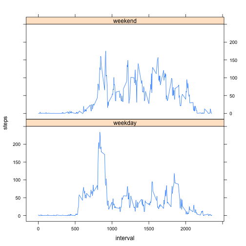

# Reproducible Research: Peer Assessment 1
========================================
[https://github.com/vladdy/RepData_PeerAssessment1](https://github.com/vladdy/RepData_PeerAssessment1)

The global setting for the markdown:


```r
options(scipen = 1, digits = 2)
opts_chunk$set(echo = TRUE)
```


## Loading and preprocessing the data


```r
data <- read.csv("activity.csv", header = TRUE)  # load the data from the current working directory
data$date <- as.Date(data$date)  # fix data type missed during loading 
agg_by_day <- aggregate(steps ~ date, data, sum)  # find total steps per day (we are allowed to use NA's here)
agg_by_interval <- aggregate(steps ~ interval, data, mean, na.rm = TRUE)  # find total steps per interval
```


## What is mean total number of steps taken per day?

1. *Make a histogram of the total number of steps taken each day*

  
  ```r
  hist(agg_by_day$steps, col = "blue", main = "Total Steps Taken by Day", xlab = "Daily Total Steps")
  ```
  
   


2. *Calculate and report the __mean__ and __median__ total number of steps taken per day*

  
  ```r
  mean(agg_by_day$steps, na.rm = TRUE)
  ```
  
  ```
  ## [1] 10766
  ```
  
  ```r
  median(agg_by_day$steps, na.rm = TRUE)
  ```
  
  ```
  ## [1] 10765
  ```


  The **mean** is *10766.19* and the **median** is *10765*.


## What is the average daily activity pattern?

1. *Make a time series plot (i.e. `type = "l"`) of the 5-minute interval (x-axis) and the average number of steps taken, averaged across all days (y-axis)*

  
  ```r
  plot(agg_by_interval$interval, agg_by_interval$steps, type = "l", col = "blue", 
      main = "Mean Number of Steps by 5 minute Interval", ylab = "# of steps", 
      xlab = "5 Minute Interval")
  ```
  
   

2. *Which 5-minute interval, on average across all the days in the dataset, contains the maximum number of steps?*
  
  
  ```r
  agg_by_interval[max(agg_by_interval$steps) == agg_by_interval$steps, ]
  ```
  
  ```
  ##     interval steps
  ## 104      835   206
  ```

  
  The 5-minute interval 835 contains the maximum number of steps 206.17.

## Imputing missing values

1. *Calculate and report the total number of missing values in the dataset (i.e. the total number of rows with `NA`s)*

  
  ```r
  sum(is.na(data))
  ```
  
  ```
  ## [1] 2304
  ```

  
  There are *2304*  missing values in the dataset.

2. *Devise a strategy for filling in all of the missing values in the dataset. The strategy does not need to be sophisticated. For example, you could use the mean/median for that day, or the mean for that 5-minute interval, etc.*

  The mean for that 5-minute interval strategy will be used.
  
3. *Create a new dataset that is equal to the original dataset but with the missing data filled in.*

  
  ```r
  imputed_data <- data
  imputed_data$ID <- as.numeric(rownames(imputed_data))
  imputings <- merge(imputed_data[!complete.cases(imputed_data), ][, -1], agg_by_interval, 
      all.x = T, sort = F, by = "interval")
  imputed_data[!complete.cases(imputed_data), ] <- imputings[order(imputings$ID), 
      names(imputed_data)]
  sum(complete.cases(imputed_data)) == nrow(imputed_data)  # confirming no incomplete cases left
  ```
  
  ```
  ## [1] TRUE
  ```


4. *Make a histogram of the total number of steps taken each day and Calculate and report the __mean__ and __median__ total number of steps taken per day. Do these values differ from the estimates from the first part of the assignment? What is the impact of imputing missing data on the estimates of the total daily number of steps?*

  
  ```r
  imputed_agg_by_day <- aggregate(steps ~ date, imputed_data, sum)
  hist(imputed_agg_by_day$steps, col = "green", main = "Total Steps Taken by Day (Imputed)", 
      xlab = "Daily Total Steps")
  ```
  
   
  
  ```r
  mean(agg_by_day$steps, na.rm = TRUE) - mean(imputed_agg_by_day$steps)
  ```
  
  ```
  ## [1] 0
  ```
  
  ```r
  median(agg_by_day$steps, na.rm = TRUE) - median(imputed_agg_by_day$steps)
  ```
  
  ```
  ## [1] -1.2
  ```

  
  With the chosen imputing strategy, the mean total daily number of steps value was unchanged (i.e. 0) while the median value is slightly larger (1.19) in the imputed data.

## Are there differences in activity patterns between weekdays and weekends?

1. *Create a new factor variable in the dataset with two levels -- "weekday" and "weekend" indicating whether a given date is a weekday or weekend day.*

  
  ```r
  table(weekdays(data$date))
  ```
  
  ```
  ## 
  ##    Friday    Monday  Saturday    Sunday  Thursday   Tuesday Wednesday 
  ##      2592      2592      2304      2304      2592      2592      2592
  ```
  
  ```r
  data$day <- factor((weekdays(data$date) == "Saturday" | weekdays(data$date) == 
      "Sunday"), labels = c("weekday", "weekend"))
  table(data$day)
  ```
  
  ```
  ## 
  ## weekday weekend 
  ##   12960    4608
  ```


2. *Make a panel plot containing a time series plot (i.e. `type = "l"`) of the 5-minute interval (x-axis) and the average number of steps taken, averaged across all weekday days or weekend days (y-axis).*
  
  ```r
  agg_by_interval_day <- aggregate(steps ~ interval + day, data, mean)
  library(lattice)
  xyplot(steps ~ interval | day, data = agg_by_interval_day, layout = c(1, 2), 
      type = "l")
  ```
  
   

